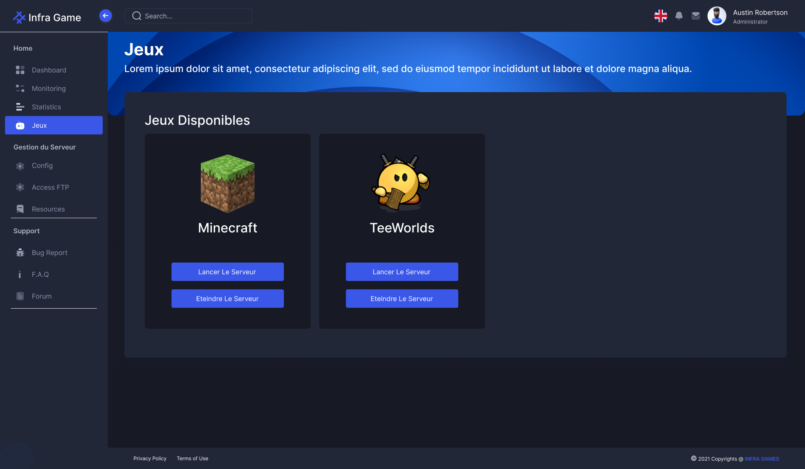
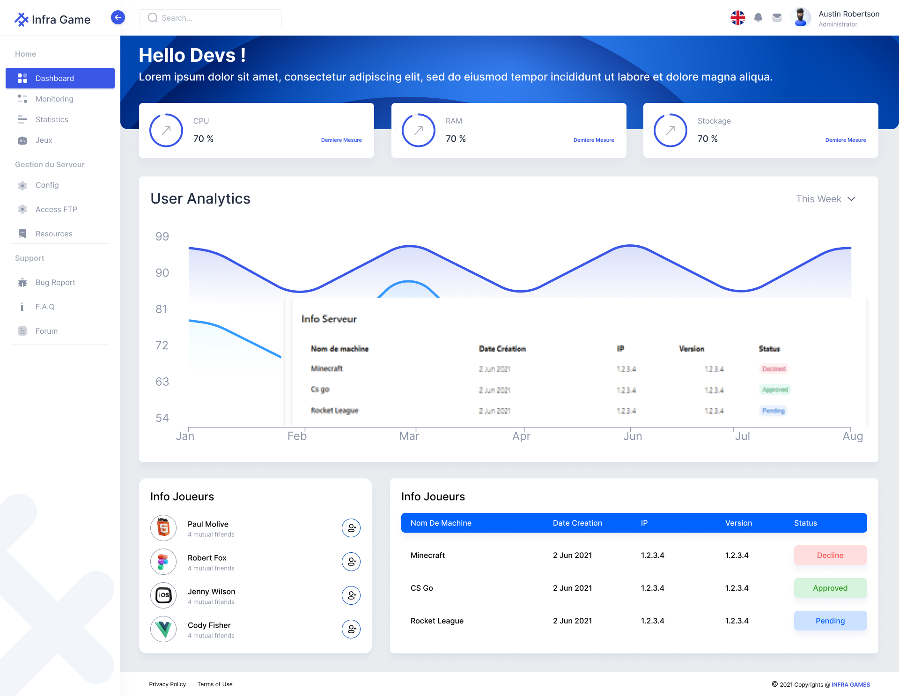
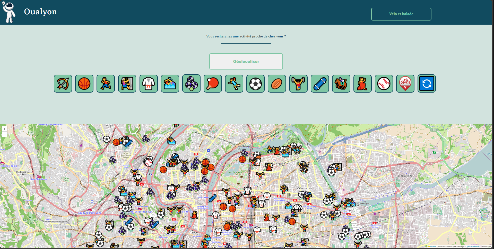
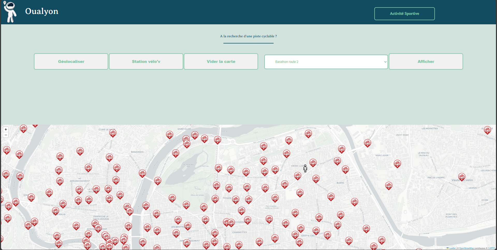
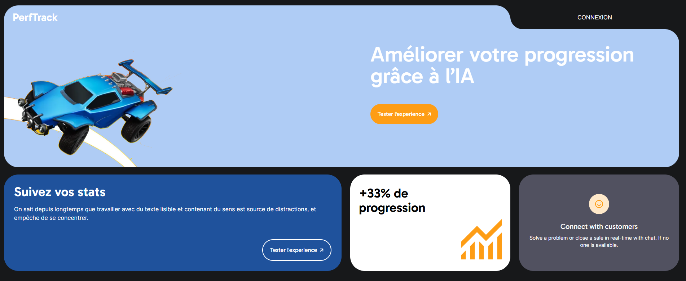
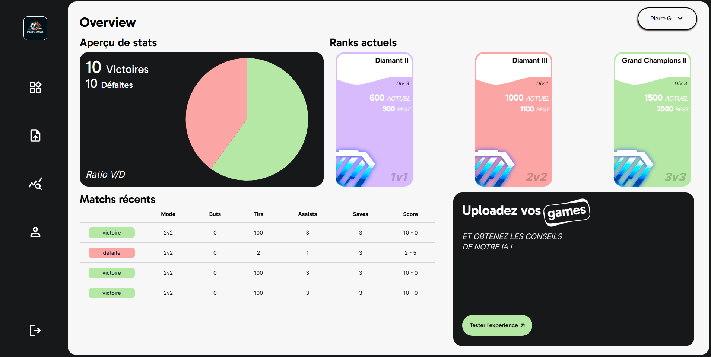
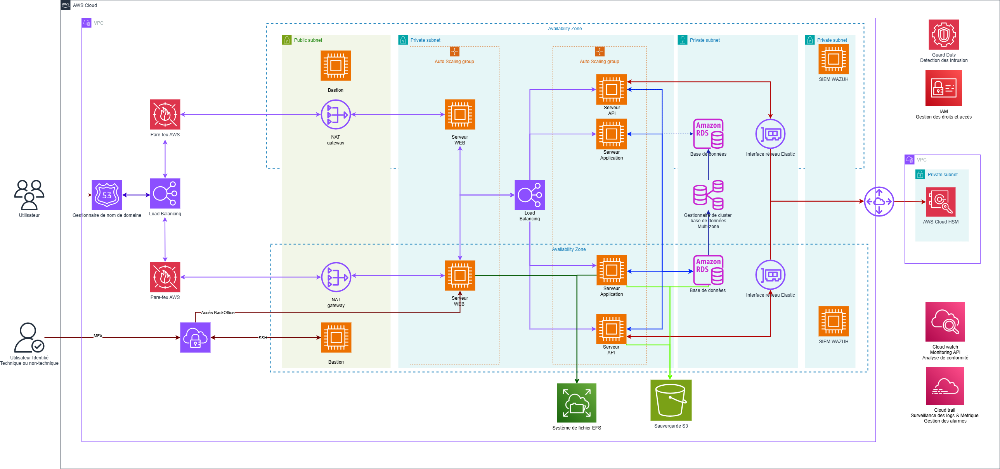

# DevOps Projects

Welcome to the DevOps Projects repository! This repository showcases various projects and scripts related to DevOps practices and tools. These projects are aimed at helping you understand and implement DevOps methodologies, CI/CD pipelines, infrastructure as code, containerization, and more.

## Table of Contents

- [Projects Overview](#projects-overview)
- [School project 1: Infragame](#school-project-1-infragame)
- [School project 2: Oualyon](#school-project-2-oualyon)
- [School project 3: Perftrack](#school-project-3-perftrack)

## Projects Overview

This repository contains several projects demonstrating various aspects of DevOps. Each project is organized into its own directory with detailed instructions on how to set up and use the project. Below is an overview of the included projects:

## School project 1: Infragame
### Project Manager 

The "Infra Game" project is part of the YDAYS educational initiative organized by Ynov, aimed at developing an innovative automated video game deployment system for students. 
Our main objective was to create a web platform integrated with a continuous integration and deployment chain (CI/CD), using Kubernetes containers and an API to orchestrate the whole process. 

As a project manager, my responsibilities encompassed:

- Leading a multidisciplinary team
> 3 in cloud and infrastructure , 3 in web development , 3 in cybersecurity
- Facilitating effective communication across different teams
> 3 team in the project and team for the infrastructure management 
- Coordinating and streamlining development processes
- Verifying and approving each deployment
- Overseeing cybersecurity measures
- Defining strategic objectives
- Planning project milestones
- Overseeing development and testing activities

These duties ensured the successful execution and delivery of projects, while maintaining high standards of quality and security.

### Skills involved

- Project management: Planning, coordination, and monitoring of development and deployment phases.
- Infrastructure and Cloud: Design and implementation of infrastructure on Kubernetes to ensure scalability and resilience of the system.
- API development: Creation and management of the API required for the platform to function properly.
- CI/CD: Configuration and automation of CI/CD pipelines to ensure fast, reliable deployments.
- Web technologies: Experience in creating effective, user-friendly websites and user interfaces.
- Security: Implementing best practices in cybersecurity to protect the platform and user data.

## School project 2: Oualyon

The "oualyon" project is part of the YDAYS educational initiative organized by Ynov. Over the course of a school year, our six-member team collaborated on this multi-disciplinary project to develop an interactive website presenting data extracted from a website, using a variety of skills: 2 data scientists, 2 data engineers, 1 web developer, and myself as the DevOps engineer.

As DevOps, I was responsible for several key aspects of the project: I developed and deployed the API in Node.js to manage the data, facilitating the transformation from GeoJSON to JSON format. In addition, I configured and deployed an AWS instance with NGINX to guarantee the availability and performance of our web application. At the same time, I implemented best practices for collaborative development on GitHub, ensuring efficient code and version management.

One of my significant roles was also the development of the interactive map using Leaflet, integrating processed data to provide an intuitive and informative user experience.

### Skills involved

- Data extraction and analysis from websites
- Data transformation (GeoJSON to JSON)
- Web interface development using Leaflet for interactive maps
- Node.js API development (Express.js)
- AWS infrastructure deployment and management
- NGINX configuration for web server setup
- Version control and collaboration using GitHub

## School project 3: Perftrack

The aim of the "PerfTrack" project was to develop an interface for analyzing Rocket League games. This platform allowed users to submit .replay files of their games, which were then sent to an AI for detailed analysis, providing relevant and informative feedback.

As MLOPS on this ambitious project, my main responsibility was to deploy and maintain the infrastructure hosting both the website and the AI on AWS. I worked to guarantee the availability, security, and performance of the platform throughout the development process.

### Skills involved

- Management of AWS infrastructure: Configuration and deployment of EC2 instances, management of services such as S3 and IAM to ensure optimal operation of the application.
- Deployment and management of web services: Use of web technologies to create an intuitive and efficient user interface.
- AI integration: Collaboration with AI specialists to integrate Rocket League's game analysis models.
- Security and performance: Implementing best practices in security and performance optimization to ensure an optimal user experience.
- Monitoring and maintenance: Continuous monitoring of the infrastructure to quickly identify and resolve any problems.

## Project: WePlants Infrastructure 

The "WePlants" project is a cloud-based infrastructure aimed at ensuring the scalable, secure, and high-performance deployment of web applications. This infrastructure leverages Amazon Web Services (AWS) to deliver robust solutions for web services, API management, database hosting, and monitoring. The architecture integrates several key AWS services, each playing a critical role in maintaining the application's availability, security, and scalability.This infrastructure was built as part of my end-of-study project. The aim was to set up an infrastructure resilient to failures and capable of managing the various cybersecurity risks.

## Architecture Components
### Users and Domain Management:

- Users interact with the application through a domain managed by AWS Route 53, which provides DNS and domain name management services.
- The architecture supports both technical and non-technical users, ensuring a secure and seamless user experience.

### Load Balancing and Security:

- AWS Load Balancer distributes incoming traffic across multiple web and application servers to ensure high availability and reliability.
- AWS Firewall provides an additional layer of security, controlling and monitoring access to the infrastructure.

### Network Segmentation:

- The infrastructure is divided into public and private subnets within a Virtual Private Cloud (VPC), enhancing security by isolating critical resources.
- A Bastion host within the public subnet provides secure SSH access to resources in the private subnet, while a NAT Gateway enables secure internet access for servers in the private subnet.

### Compute Resources:

- Auto-scaling groups manage the scaling of web, API, and application servers, ensuring that the infrastructure adapts dynamically to changing workloads.
- These servers are hosted within private subnets, protected from direct internet access.

### Database Management:

- Amazon RDS (Relational Database Service) is used for database management, offering automated backups, software patching, and scaling capabilities.
- The architecture includes an Amazon RDS Multi-AZ deployment for enhanced availability and failover support. (Not Implemented)

### Security and Monitoring:

- AWS CloudTrail and CloudWatch services are integrated for logging, monitoring, and compliance analysis, enabling continuous monitoring of API usage and system performance.
- GuardDuty and SIEM Wazuh are deployed for intrusion detection and security monitoring, safeguarding the infrastructure against potential threats.

### Data Storage and Backup:

- The architecture utilizes Amazon S3 for object storage and backup, ensuring that critical data is securely stored and easily retrievable.
- An Elastic File System (EFS) is implemented for scalable file storage, providing shared access to files across multiple instances.

### Encryption and Key Management:

- AWS Cloud HSM (Hardware Security Module) is employed for secure key management, supporting encryption and decryption operations for sensitive data. (Not Implemented)

### Key Responsibilities and Skills
- Infrastructure Management: Design and deployment of AWS-based infrastructure, ensuring scalability, security, and reliability.
- Security Implementation: Configuration of firewalls, intrusion detection systems, and secure access protocols to protect the infrastructure.
- Monitoring and Compliance: Use of AWS CloudTrail and CloudWatch for monitoring system performance, API usage, and compliance with security policies.
- Database Administration: Management of Amazon RDS instances, including backups, scaling, and failover configurations.
- Data Management: Implementation of S3 for backup storage and EFS for shared file storage across instances.