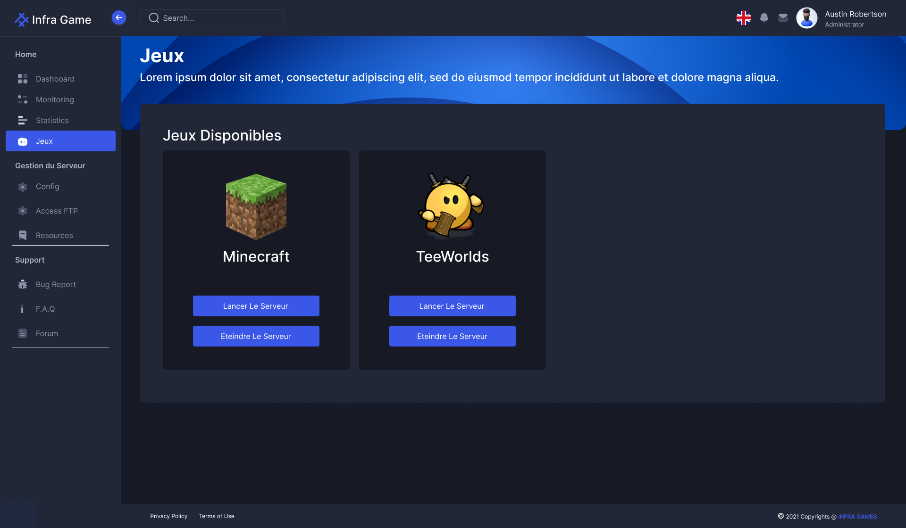
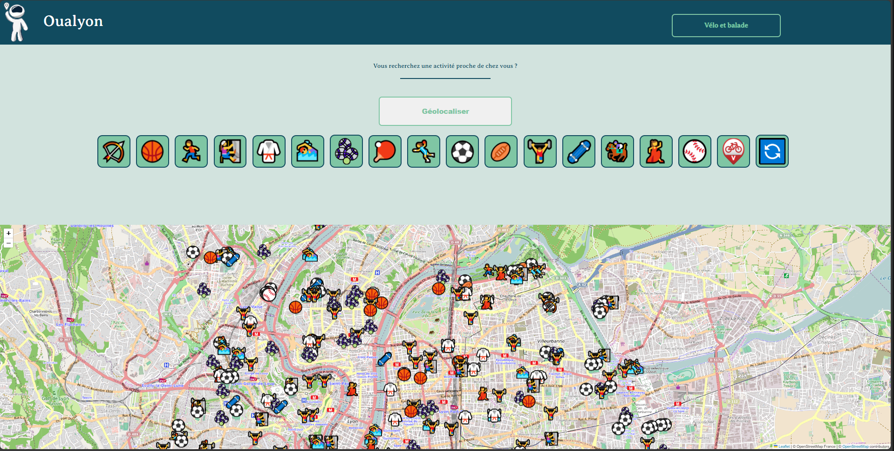
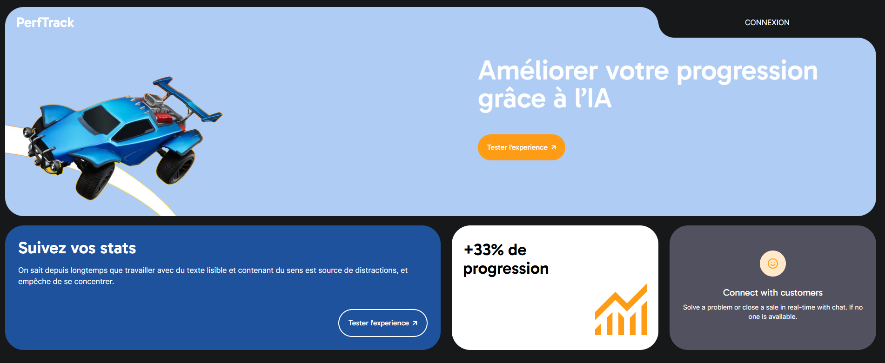
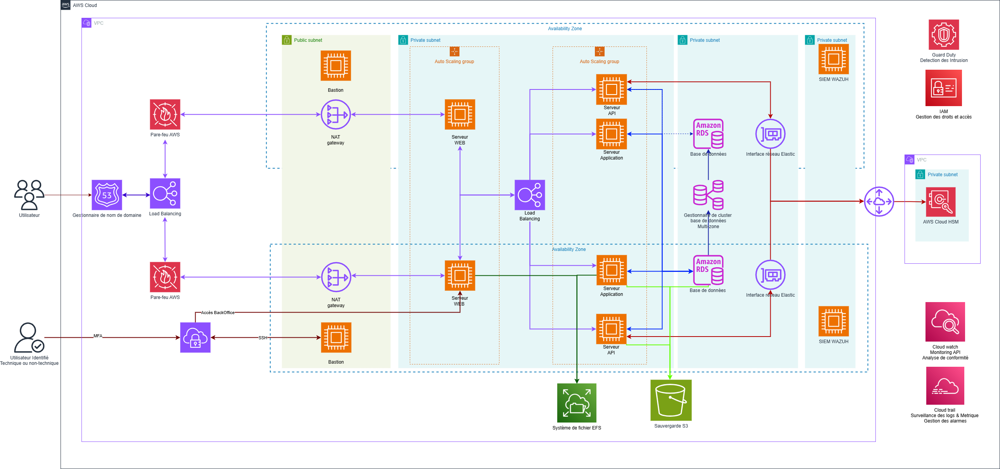

# Projects

A selection of DevOps, infrastructure, and cloud projects — built across academic and professional contexts.

## School Projects

  

    <h3 class="project-title">Infragame</h3>
    Project Manager
  

  

    Automated video game deployment platform built as part of the YDAYS initiative at Ynov.
    A web platform integrated with a full CI/CD chain, Kubernetes containers, and an orchestration API.
    Led a 9-person multidisciplinary team spanning cloud, web dev, and cybersecurity.
  

  

    
<strong>Key responsability :</strong>

  <ul>
    <li><strong>Project management: </strong> — Planning, coordination, and monitoring of development and deployment phases.</li>
    <li><strong>Infrastructure and Cloud:</strong> — Design and implementation of infrastructure on Kubernetes to ensure scalability and resilience of the system.</li>
    <li><strong>API development:</strong> — Creation and management of the API required for the platform to function properly.</li>
    <li><strong>CI/CD:</strong> — Configuration and automation of CI/CD pipelines to ensure fast, reliable deployments.</li>
    <li><strong>Web technologies: </strong> —  Experience in creating effective, user-friendly websites and user interfaces.</li>
    <li><strong>Security: </strong> —  Implementing best practices in cybersecurity to protect the platform and user data.</li>
  </ul>

  

    Kubernetes
    CI/CD
    Project Management
    API
    Security
  

  

    <h3 class="project-title">Oualyon</h3>
    DevOps Engineer
  

  

    Interactive data visualization website presenting scraped geospatial data.
    Built and deployed the Node.js API handling GeoJSON → JSON transformation, configured an AWS EC2 instance with NGINX,
    and developed the interactive map with Leaflet.js. 6-person team across data science, engineering, and web dev.
  

  

  
  
<strong>Key responsability :</strong>

  <ul>
    <li><strong>Data management:</strong> — Data extraction and analysis from websites and Data transformation (GeoJSON to JSON)</li>
    <li><strong>Web devellopement:</strong> — Web interface development using Leaflet for interactive maps , Node.js API development (Express.js)</li>
    <li><strong>Management of AWS infrastructure:</strong> — AWS infrastructure deployment and management</li>
    <li><strong>Web Serveurs: </strong> — NGINX configuration for web server setup</li>
    <li><strong>Version control: </strong> — Version control and collaboration using GitHub</li>
  </ul>

  

    Node.js
    AWS EC2
    NGINX
    Leaflet.js
    GeoJSON
    GitHub
  

  

    <h3 class="project-title">PerfTrack</h3>
    MLOps Engineer
  

  

    Rocket League game analysis platform. Users submit <code>.replay</code> files processed by an AI model
    for detailed performance feedback. Responsible for deploying and maintaining the full AWS infrastructure
    hosting both the web app and the AI backend — EC2, S3, IAM, security, and monitoring.
  

  

  
<strong>Key responsability :</strong>

  <ul>
    <li><strong>Management of AWS infrastructure:</strong> — Configuration and deployment of EC2 instances, management of services such as S3 and IAM to ensure optimal operation of the application.</li>
    <li><strong>Deployment and management of web services:</strong> — Use of web technologies to create an intuitive and efficient user interface.</li>
    <li><strong>AI integration:</strong> — Collaboration with AI specialists to integrate Rocket League’s game analysis models.</li>
    <li><strong>Security and performance: </strong> — Implementing best practices in security and performance optimization to ensure an optimal user experience.</li>
    <li><strong>Monitoring and maintenance: </strong> —Continuous monitoring of the infrastructure to quickly identify and resolve any problems.</li>
  </ul>

  

    AWS
    EC2 / S3 / IAM
    MLOps
    Security
    Monitoring
  

## End-of-Study Project

  

    <h3 class="project-title">WePlants Infrastructure</h3>
    Cloud Architect
  

  

    Production-grade AWS infrastructure designed for scalability, high availability, and security.
    Built as my end-of-study (capstone) project, the objective was to deploy a resilient architecture
    capable of handling failures and mitigating cybersecurity risks while hosting a full-stack web application.
  

  

<strong>Architecture components:</strong>

<ul>
  <li>
    <strong>Users & domain management</strong> 
    Users access the application through a domain managed by AWS Route 53, ensuring reliable DNS resolution and secure entry points.
  </li>

  <li>
    <strong>Load balancing & security</strong> 
    An AWS Application Load Balancer distributes incoming traffic across multiple instances to ensure high availability.
    AWS Firewall adds an additional security layer by filtering and monitoring traffic.
  </li>

  <li>
    <strong>Network segmentation</strong> 
    The infrastructure is deployed within a VPC using public and private subnets to isolate critical components.
    A Bastion host enables secure administrative access, while a NAT Gateway allows outbound internet access for private resources.
  </li>

  <li>
    <strong>Compute resources</strong> 
    Auto Scaling Groups dynamically manage web, API, and application servers based on workload.
    All compute resources are hosted in private subnets to prevent direct exposure to the internet.
  </li>

  <li>
    <strong>Database management</strong> 
    Amazon RDS is used for relational data storage with automated backups and scaling capabilities.
    A Multi-AZ deployment ensures high availability and failover support.
  </li>

  <li>
    <strong>Security & monitoring</strong> 
    AWS CloudTrail and CloudWatch provide logging, monitoring, and compliance tracking.
    GuardDuty and Wazuh (SIEM) are used for threat detection and security monitoring.
  </li>

  <li>
    <strong>Storage & backup</strong> 
    Amazon S3 is used for object storage and backups.
    EFS provides shared, scalable file storage accessible by multiple instances.
  </li>

  <li>
    <strong>Encryption & key management</strong> 
    AWS CloudHSM is considered for secure key management and cryptographic operations (not implemented).
  </li>
</ul>

<strong>Key responsibilities:</strong>

<ul>
  <li><strong>Infrastructure design</strong> — Designed and deployed a scalable and resilient AWS architecture</li>
  <li><strong>Security implementation</strong> — Configured firewalling, intrusion detection, and secure access patterns</li>
  <li><strong>Monitoring & compliance</strong> — Implemented logging and monitoring using CloudTrail and CloudWatch</li>
  <li><strong>Database administration</strong> — Managed RDS configuration, backups, and high availability setup</li>
  <li><strong>Data management</strong> — Implemented S3 and EFS for storage and backup strategies</li>
</ul>

  

    AWS
    VPC
    Route 53
    RDS
    CloudWatch
    GuardDuty
    Wazuh
    S3 / EFS
    Auto Scaling
  

