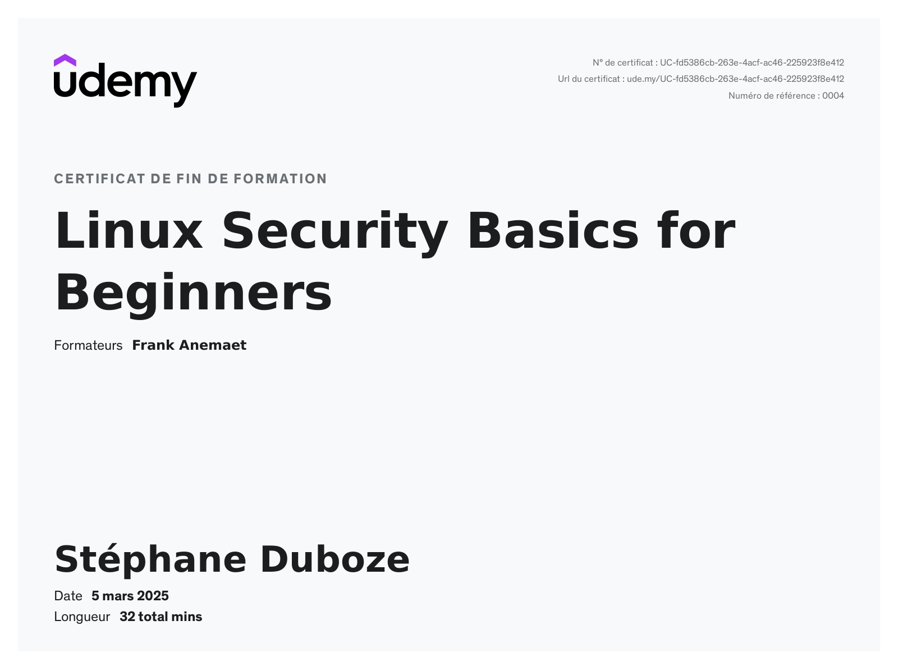

# Skills:

- IT infrastructure management (SecNumCloud environments, 100+ VM clusters)
- CI/CD pipeline optimization
- Automation with Ansible, Chef compliance, and Power Automate
- Monitoring and supervision with ELK, Grafana, Zabbix, Prometheus, Jira, and ITSM
- Systems administration under Red Hat / CentOS
- Vulnerability management and patch remediation
- Integration of green IT

This experience has allowed me to develop deep expertise in managing complex infrastructures and optimizing automated processes while ensuring the reliability and efficiency of IT systems for various clients.

## Technical Skills:
- Programming Languages, Automation and Scripting: 

 

 

- Cloud & Virtualization: 

 

- Infrastructure as Code (IaC):

 

- CI/CD: Skilled in setting up and maintaining CI/CD pipelines using 

 
 

- Monitoring and Logging: 

 

- Containerization and hosting: 

 

- Databases: 

- Security: 
  - Strong understanding of cybersecurity principles
  - Network security — F5 BIG-IP, firewall management
  - Vulnerability scanning, risk analysis, and remediation
  - Best practices for securing cloud infrastructure and applications
  -  / 

## Languages

| Language | Level |
|----------|-------|
| French   | Native |
| English  | C1 — Professional proficiency |
| Mandarin | A1 — Beginner |

## Certification 

### Badge

####  <a href="https://www.credly.com/users/stephane-duboze"> More on Credly

### Cybersecurity

<iframe style="border: 0; width:100%;  overflow: auto;" src="https://tryhackme.com/api/v2/badges/public-profile?userPublicId=188166" ></iframe>

### Udemy 

### Linkedin 
<embed src="./assets/img/Linkedin/expert_en_DevOps.pdf" width="500px" height="430px"/>