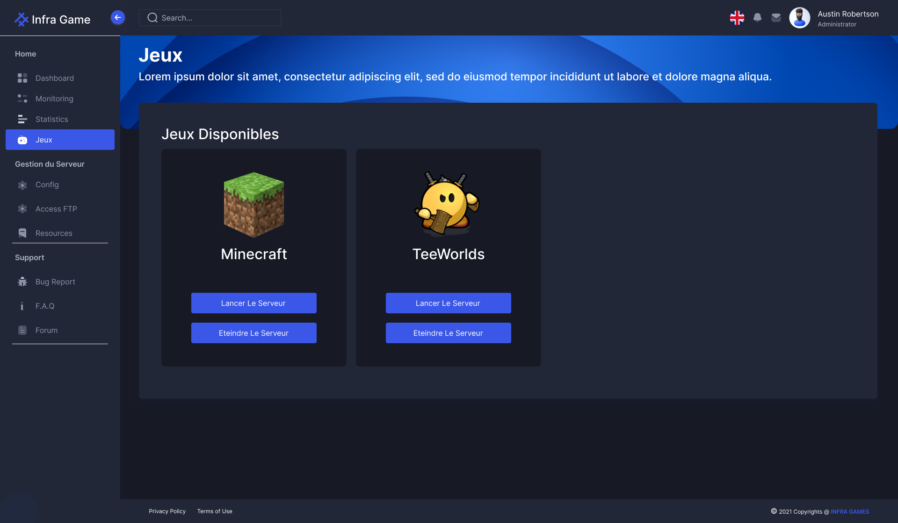
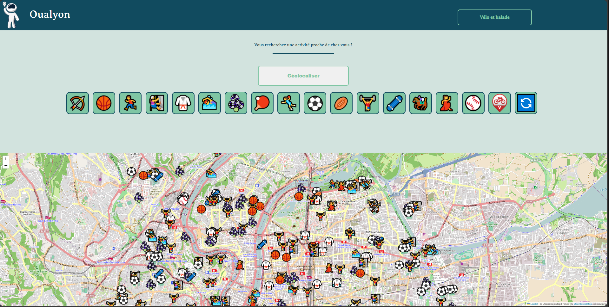
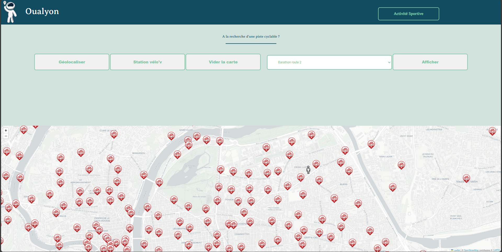
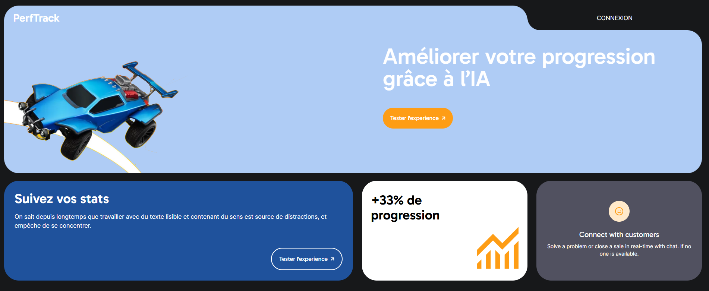
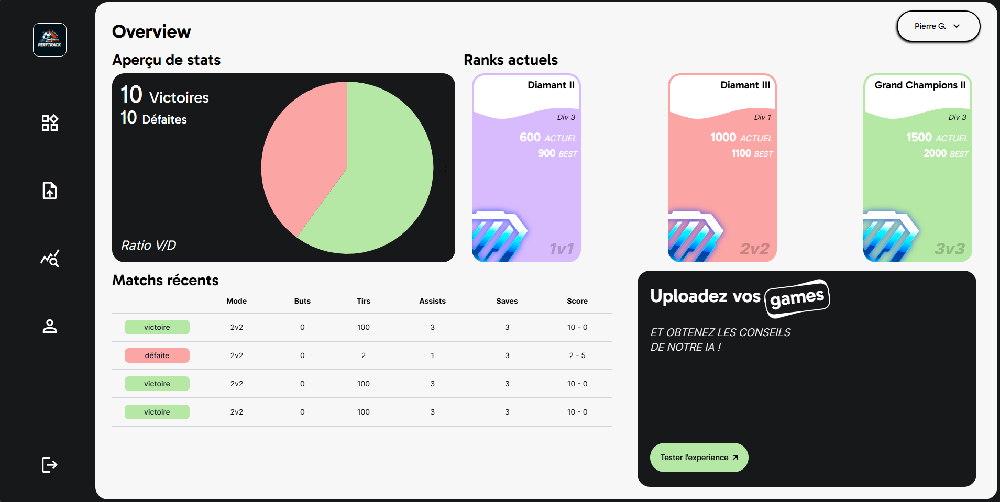

# DevOps Projects

Welcome to the DevOps Projects repository! This repository showcases various projects and scripts related to DevOps practices and tools. These projects are aimed at helping you understand and implement DevOps methodologies, CI/CD pipelines, infrastructure as code, containerization, and more.

## Table of Contents

- [Projects Overview](#projects-overview)
- [School project 1: Infragame](#school-project-1-infragame)
- [School project 2: Oualyon](#school-project-2-oualyon)
- [School project 3: Perftrack](#school-project-3-perftrack)

## Projects Overview

This repository contains several projects demonstrating various aspects of DevOps. Each project is organized into its own directory with detailed instructions on how to set up and use the project. Below is an overview of the included projects:

## School project 1: Infragame

The "Infra Game" project is part of the YDAYS educational initiative organized by Ynov, aimed at developing an innovative automated video game deployment system for students. Our main objective was to create a web platform integrated with a continuous integration and deployment chain (CI/CD), using Kubernetes containers and an API to orchestrate the whole process.

As project manager on this ambitious project, I led a multidisciplinary team, coordinating development, deployment, infrastructure management, and cybersecurity. My responsibilities included defining strategic objectives, planning project milestones, and overseeing development and testing activities.

### Skills involved

- Project management: Planning, coordination, and monitoring of development and deployment phases.
- Infrastructure and Cloud: Design and implementation of infrastructure on Kubernetes to ensure scalability and resilience of the system.
- API development: Creation and management of the API required for the platform to function properly.
- CI/CD: Configuration and automation of CI/CD pipelines to ensure fast, reliable deployments.
- Web technologies: Experience in creating effective, user-friendly websites and user interfaces.
- Security: Implementing best practices in cybersecurity to protect the platform and user data.

## School project 2: Oualyon

The "oualyon" project is part of the YDAYS educational initiative organized by Ynov. Over the course of a school year, our six-member team collaborated on this multi-disciplinary project to develop an interactive website presenting data extracted from a website, using a variety of skills: 2 data scientists, 2 data engineers, 1 web developer, and myself as the DevOps engineer.

As DevOps, I was responsible for several key aspects of the project: I developed and deployed the API in Node.js to manage the data, facilitating the transformation from GeoJSON to JSON format. In addition, I configured and deployed an AWS instance with NGINX to guarantee the availability and performance of our web application. At the same time, I implemented best practices for collaborative development on GitHub, ensuring efficient code and version management.

One of my significant roles was also the development of the interactive map using Leaflet, integrating processed data to provide an intuitive and informative user experience.

### Skills involved

- Data extraction and analysis from websites
- Data transformation (GeoJSON to JSON)
- Web interface development using Leaflet for interactive maps
- Node.js API development (Express.js)
- AWS infrastructure deployment and management
- NGINX configuration for web server setup
- Version control and collaboration using GitHub

## School project 3: Perftrack

The aim of the "PerfTrack" project was to develop an interface for analyzing Rocket League games. This platform allowed users to submit .replay files of their games, which were then sent to an AI for detailed analysis, providing relevant and informative feedback.

As MLOPS on this ambitious project, my main responsibility was to deploy and maintain the infrastructure hosting both the website and the AI on AWS. I worked to guarantee the availability, security, and performance of the platform throughout the development process.

### Skills involved

- Management of AWS infrastructure: Configuration and deployment of EC2 instances, management of services such as S3 and IAM to ensure optimal operation of the application.
- Deployment and management of web services: Use of web technologies to create an intuitive and efficient user interface.
- AI integration: Collaboration with AI specialists to integrate Rocket League's game analysis models.
- Security and performance: Implementing best practices in security and performance optimization to ensure an optimal user experience.
- Monitoring and maintenance: Continuous monitoring of the infrastructure to quickly identify and resolve any problems.
